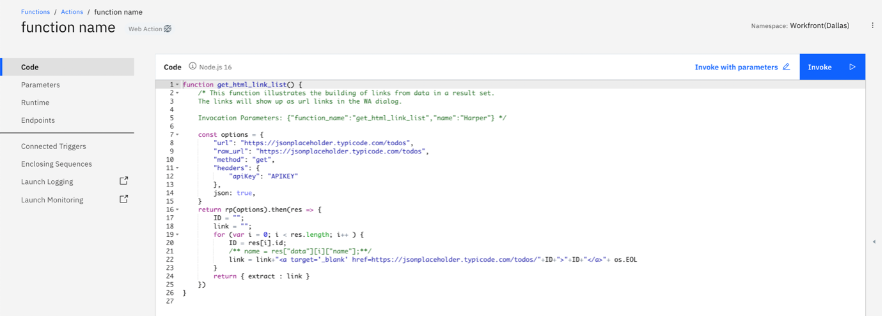

Web functions are low-code solutions that can be implemented by your API developer using predefined Python or Node.js templates.
Here is a step by step guide to implement web function:
Web functions are available on IBM cloud > Functions > Actions

Tip: Make sure your Function namespace and your Watson Assistant both are on same region.

Step 1: Create an Action by providing a name and selecting a runtime environment (which could be python or node.js) and click on Create:

 
Step 2: One can use the predefined API templates and modify them to create a custom program that fits a particular need. Here are templates for NodeJS and Python languages.  Simply, cut and paste the code into your Web Function action. 

The above code displays multiple conditions and when the parsed value matches the parameter value the code gets executed. 
- Here, the “url: and raw_url:” are API endpoint URLs. 
- API key can be setup, if needed otherwise could be removed. 
- Request “method” could be “get”, “put” or “post. 
- One can manipulate the return values in the return block.

Once done, Save the function. You will see Invoke and Invoke with Parameters as below:

Click on the Invoke with Parameters and add key, value pair to call a webhook as shown below. Apply the change and click on Invoke to validate it.

Step 3: Now, select Endpoints from the left-hand side of the page and check Enable as Web Action and Save your changes.
Copy down the URL that’s created under Web Actions, you’ll need this later.

=
Now that you have the program/function ready, you would like to know how to integrate it or link it with your Watson Assistant. This is where the WebHooks come in to play.
Webhooks are used to bridge two applications/programs/functions which gets triggered by a specific event and transfer data on a near real time basis.
The webhook mechanism allow program to call an external program. When used in a dialog skill, a webhook gets triggered at the moment Watson Assistant processes a node for which webhook is enabled. The webhook collects the specified data or the data that the program collects from the user during the conversation and stores in context variables. It sends the data as part of a HTTP POST request to the URL you specify as part of your webhook definition. The URL that receives the webhook is the listener. It performs a predefined action on the information passed and returns a desired response.
Let’s see how to enable it.
Step 1 — Open Watson Assistant > Dialogs > Options > Webhooks:
You will land on the window which looks like the one below. Now, we need to copy the endpoint of a web action we created above and paste it in the URL field along with the “.json” suffix as shown in the below screenshot:

Step 2 — Build Dialog:
Now, let’s create the conversational part. Navigate yourself to the Dialog section and click on Create Dialog. You will see how a basic dialog tree builds up. Create a new dialog node by clicking on Add Node.
Go to the dialog node you just created and click on Customize on the top right corner with gear icon. Now enable Call out to webhooks / actions and select the Call a webhook as shown below: 

Step 3 — Define Responses: 
 Select the intent you want to use and provide the key, value pair for a webhook call: 

 
After that name the returning variable. 
Values from the repones can be extracted using the following code:
<? $webhook_result_1.extract.data.count  ?>
11response

Step 4 — Check Result:
You can easily try out your assistant by clicking on “Try it” on the right side. Pose different questions and notice the result! Have a look at the structure $webhook_result_1 by clicking on “Manage Context” in the Try Out Pane.

 

Now you have successfully integrated third party App/API with your Assistant, Cheers!!
See the use case in action:
Asset:https://techzone.ibm.com/collection/watson-assistant-for-backend-data-access
Demo:https://htmlpreview.github.io/?https://github.com/jaypandyaibm/WAWFuction.github.io/blob/main/AcmeCorp.html
Now Your turn 

